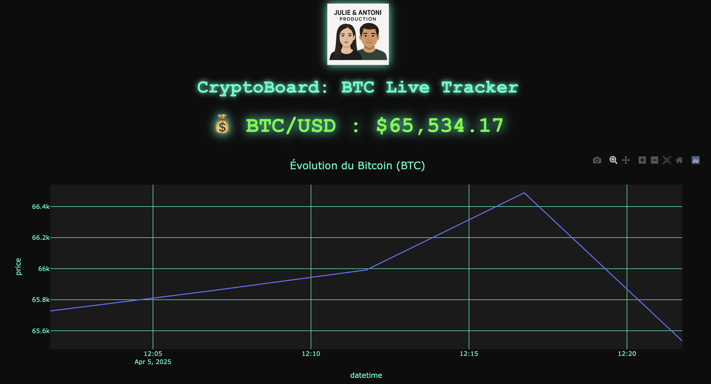

# 🟢 CryptoBoard: BTC Live Tracker

## 📈 Description
Ce dashboard interactif permet de suivre l’évolution du prix du Bitcoin (BTC/USD) en temps réel via des données simulées.  
Il inclut :
- Un compteur dynamique basé sur les dernières données
- Un graphique personnalisé (thème sombre, néon vert, style techno)
- Un logo de l’équipe Julie & Antoni 👩🏽‍💻👨🏽‍💻

## 🛠️ Technologies utilisées
- Python 🐍
- Dash / Plotly 📊
- Pandas
- Git + GitHub

## 📸 Capture d’écran

## 📁 Fichiers
- `app.py` : le code du dashboard
- `scraper.sh` : le code pour scraper la donnée sur le site
- `bitcoin_prices.csv` : données de test
- `assets/` : images et logo

---

Julie & Antoni Production 🚀
